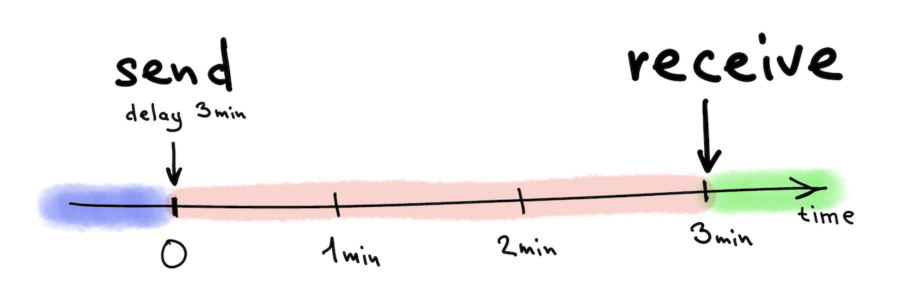
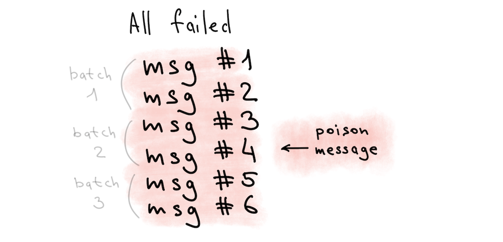
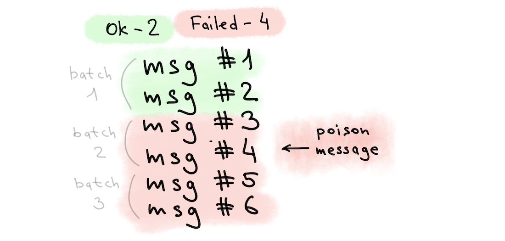
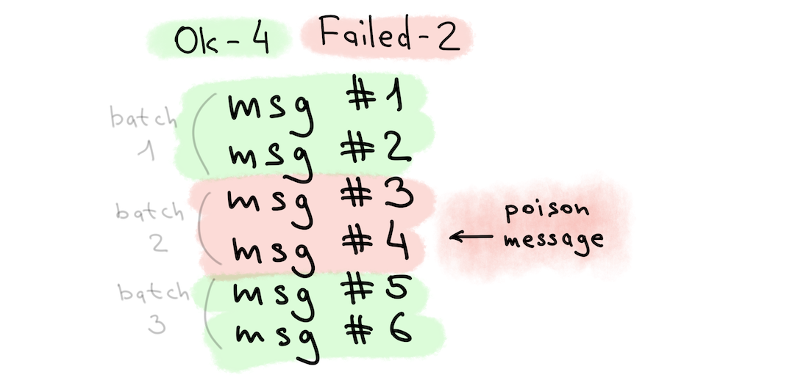

[](https://central.sonatype.com/search?namespace=io.github.vgv)
[](http://www.apache.org/licenses/LICENSE-2.0)

# kolbasa

Kolbasa is a small, efficient and capable Kotlin library to add PostgreSQL-based queues to your project.

## Features
* PostgreSQL as a persistent storage
* Message deduplication
* Message send delay (initial delay before message will be visible to consumers)
* Message visibility timeout (delay before consumed but not deleted message will be visible to another consumers)
* Configurable amount of receive attempts
* Ability to receive messages filtered by one or more meta-fields (like `user_id=42 and event_type=PAGE_VIEW`)
* Ability to receive messages sorted by one or more meta-fields (like `custom_priority desc, created asc`)
* Supports working in "external" transaction context (send/receive messages from a queue will follow "external" transaction commit/rollback)
* Batch send/receive to improve performance
* Different modes to deal with sending failures (fail all messages in a batch, send all until first failure, send as many as possible)
* Share load between different PostgreSQL servers

## Concepts
Kolbasa is a pure Kotlin library, so it can be used with any JVM language (Java, Kotlin, Clojure, Scala etc.).

Kolbasa uses PostgreSQL as a storage to manage all queues, store all messages, ensure ACID and allow filtering and sorting.
Kolbasa doesn't require any special PostgreSQL plugins or specific compile/runtime settings. It works on plain PostgreSQL
version 10 and above.

## Requirements
* PostgreSQL 10+
* JVM 17+


## How to add Kolbasa into your project
### Gradle
```groovy
implementation "io.github.vgv:kolbasa:0.184.0"
```
### Maven
```xml
<dependency>
    <groupId>io.github.vgv</groupId>
    <artifactId>kolbasa</artifactId>
    <version>0.184.0</version>
</dependency>
```

## Examples
The easiest way to try kolbasa is to try running real, working examples, illustrating different features and modes. All examples
can be found in the [examples](src/test/kotlin/examples) folder. Each example is a ready to run, complete mini-program that can
be launched from the IDE or Gradle.

The preferred way to run the examples is to use an IDE (like IntelliJ IDEA), as you can not only run the examples, but also
modify them, set breakpoints, and see how everything goes step by step. But you can also run the examples from Gradle.

To run from Gradle, you need to execute the command `./gradlew example -P name=FilterExample`, where `name` is
the name of the file from the [examples](src/test/kotlin/examples) folder.

Examples needs to have a working PostgreSQL instance to run and here you have two options:
1) The default (and easiest) way – just have running Docker on your machine. All examples will use Docker to start PostgreSQL instance.
2) If you don't want to or can't use Docker, you have a second option – use a real PostgreSQL installation.
File [ExamplesDataSourceProvider](src/test/kotlin/examples/ExamplesDataSourceProvider.kt) is the place where you can specify
url, username and password for your existing PostgreSQL instance.

### Simple example
The simplest possible example to send and receive one simple text message:
* [SimpleExample (Kotlin)](src/test/kotlin/examples/SimpleExample.kt)
* [SimpleExample (Java)](src/test/kotlin/examples/SimpleExample.java)

No filtering, no message deduplication, sharding or other features. Just send and receive one message.

`./gradlew example -P name=SimpleExample`

### Filtering and sorting
What if every message is associated with additional, user-defined meta-data such as `userId` and `priority` (for example) and
we want to receive messages with a specific userId and sort them by `priority`?

Kolbasa can receive only specific messages from a queue, and only in a specific order, using a convenient type-safe DSL. Both
filtering and ordering are performed on the queue broker side (PostgreSQL) to make receiving more efficient.

For simplicity, this example is broken into two parts:
1) First, let's look at filtering: [FilterExample](src/test/kotlin/examples/FilterExample.kt)

`./gradlew example -P name=FilterExample`

2) Second, let's add sorting here: [FilterAndSortExample](src/test/kotlin/examples/FilterAndSortExample.kt)

`./gradlew example -P name=FilterAndSortExample`

### Deduplication
Kolbasa has the ability to use deduplication when sending messages to the queue.

There are two different modes ([DeduplicationMode](src/main/kotlin/kolbasa/producer/DeduplicationMode.kt)): `ERROR` and `IGNORE_DUPLICATES`

The `ERROR` mode is the default. If you try to send a message with an existing unique key, the operation will fail and,
depending on the [PartialInsert](src/main/kotlin/kolbasa/producer/PartialInsert.kt) mode, only part of the messages (or none)
will be sent. In business code, you can handle this error and, for example, write to log, postpone sending the message or change
the unique key. Since this mode is trivial, in this example we will consider the second option, the more interesting `IGNORE_DUPLICATES` mode.

The `IGNORE_DUPLICATES` mode allows you to simply silently ignore uniqueness errors and add to the queue only those messages that
are not already in the queue. For example, you send 100 messages, 5 of which are duplicates of existing messages in the queue.
In this case, only 95 messages will be added to the queue and no errors will occur.

Example: [DeduplicationExample](src/test/kotlin/examples/DeduplicationExample.kt)

`./gradlew example -P name=DeduplicationExample`


### Send delay
By default, any message is available for receiving immediately after sending, but it often happens that the delivery of a
message needs to be delayed for some time.

Kolbasa has this option.

When sending a message, you can specify an arbitrary delay (seconds, hours, days) and the message will "appear" for consumers
no earlier than this delay expires.

For example, your service has a "Delete account" button, but you start the actual data deletion only after 30 days, thereby
giving the client the opportunity to change their mind. In this case, you can send the message "DELETE CLIENT #123456789" to a
queue and set a delivery delay of 30 days. The message will be stored in the queue all this time, and after 30 days it will
become available for reading by consumers. No additional actions are required for this, Kolbasa will do it automatically.



Example: [SendDelayExample](src/test/kotlin/examples/SendDelayExample.kt)

`./gradlew example -P name=SendDelayExample`


### Partial insert and batching
Imagine you want to send 10,000 messages with a single `Producer.send()` call, but among those 10,000 messages there is one
invalid message that cannot be sent, for example due to uniqueness constraints.

So, there will definitely be a send error, but if only one message out of 10,000 causes an error, there are several different
options for handling this situation:

1) Cancel sending all 10,000 messages
2) Send messages up to the invalid one, and do not send any messages after the invalid one. This mode is useful if you want to
preserve causal ordering
3) Send as many messages as possible, skipping only the invalid one. This is useful if the messages are not related to each other
in any way, and you just want to send as many messages as possible to the queue

However, Kolbasa does not send all messages to the queue one by one, this is very bad for performance. The library sends
messages to the queue in [batches](src/main/kotlin/kolbasa/producer/SendOptions.kt) and all errors are processed along the
boundary of these batches, so if a specific batch contains a invalid message, the entire batch will be discarded.

The easiest way to show the difference between these approaches is with pictures.
In the example below, we send 6 messages with `batchSize=2` and one poison message. It turns out, three batches, one of
which (the second) contains an incorrect message.

Depending on [PartialInsert](src/main/kotlin/kolbasa/producer/PartialInsert.kt) mode, the sending result will be different:

`PartialInsert.PROHIBITED`


`PartialInsert.UNTIL_FIRST_FAILURE`


`PartialInsert.INSERT_AS_MANY_AS_POSSIBLE`



Example: [PartialInsertExample](src/test/kotlin/examples/PartialInsertExample.kt)

`./gradlew example -P name=PartialInsertExample`


### Transaction context
Imagine that in your application you have a `customer` table containing important information about your customers - name, email
and some big and complex additional data that takes a long time to calculate. To calculate this data, you need to read a lot from
a database or even from a third-party system. It may take several minutes or even hours to obtain all the necessary data.

We can't calculate that data at the time of user registration, because it will slow down the registration process. So, the usual
solution is to postpone this task and calculate this heavy data in the background a little later. For this, it is logical to
queue the task like "Customer with id=NNN was registered". However, if the customer registration failed due to
non-unique email (for example), we do not want this task to appear in the queue at all.

We want the sending of the message to the queue to be commited (or rolled back) along with the request for user registration.
New record in the `customer` table and the new message in the queue or nothing at all.

To do this, we need to use special [ConnectionAwareDatabaseProducer](src/main/kotlin/kolbasa/producer/connection/ConnectionAwareDatabaseProducer.kt)
and [ConnectionAwareDatabaseConsumer](src/main/kotlin/kolbasa/consumer/connection/ConnectionAwareDatabaseConsumer.kt) that can
work in the context of an existing transaction. They do not take over the transaction management, completely delegating this work
to the calling code. It works perfectly with plain JDBC or more complex frameworks like [Hibernate](https://hibernate.org),
[Exposed](https://jetbrains.github.io/Exposed/home.html) etc.

Example: [TransactionContextExample](src/test/kotlin/examples/TransactionContextExample.kt)

`./gradlew example -P name=TransactionContextExample`
